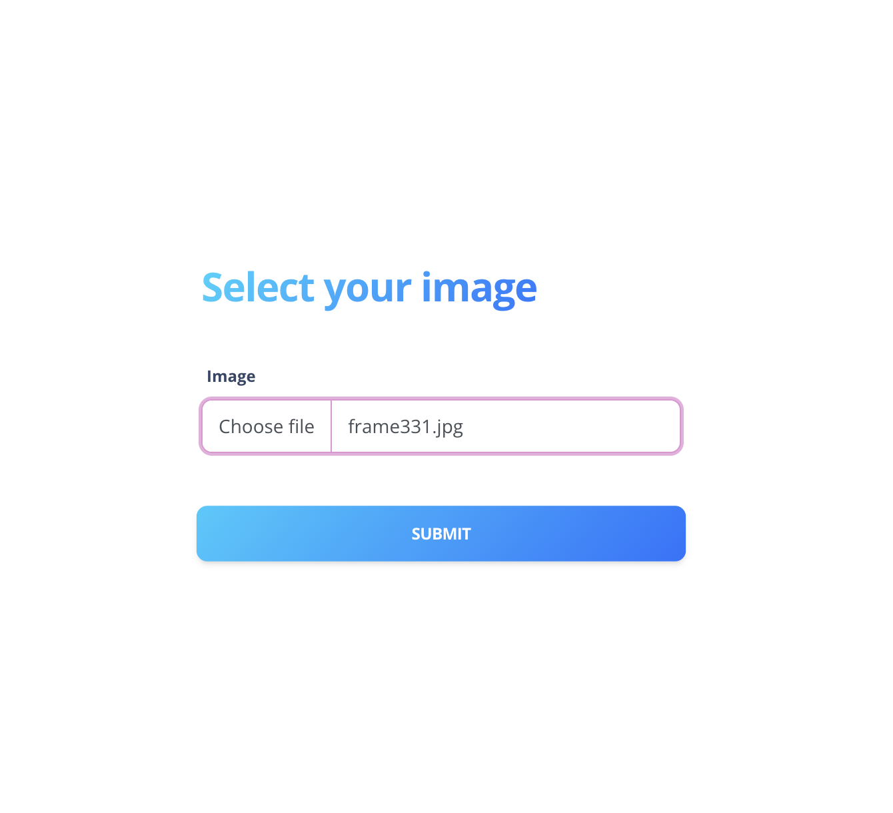
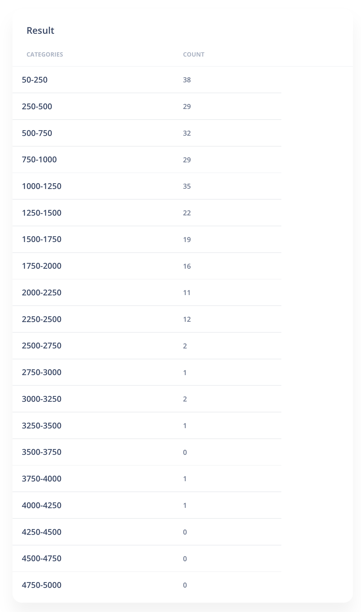

# 
# Magnus Sysanus


# Завдання:


# V1 - версія Flask server з моделью (HTML and API)
*CSS file was loaded from Internet and wasn’t created by team
Запустили для прикладу AWS instance і там розвернули docker 

## Тестувати  V1
#### [Посилання](http://18.221.119.206:3067/)
Завантаження зображення

Приклад результату



#### Comand line request

Requst
```
curl -X POST -F 'file1=@example/frame331.jpg'  http://192.168.0.161:3067/api/v1/resources/image 
docker build -t my_flask_app:v0.1 . 
docker run -p 3067:3067  my_flask_app:v0.1
```
Response
```
{"data":[{"range":"50-250","result":38},{"range":"250-500","result":29},{"range":"500-750","result":32},{"range":"750-1000","result":29},{"range":"1000-1250","result":35},{"range":"1250-1500","result":22},{"range":"1500-1750","result":19},{"range":"1750-2000","result":16},{"range":"2000-2250","result":11},{"range":"2250-2500","result":12},{"range":"2500-2750","result":2},{"range":"2750-3000","result":1},{"range":"3000-3250","result":2},{"range":"3250-3500","result":1},{"range":"3500-3750","result":0},{"range":"3750-4000","result":1},{"range":"4000-4250","result":1},{"range":"4250-4500","result":0},{"range":"4500-4750","result":0},{"range":"4750-5000","result":0}]}
```


# Запуск
## Docker 
```
cd V1
docker build -t my_flask_app:v0.1 . 
docker run -p 3067:3067  my_flask_app:v0.1
```

## Python3
```
cd V1/app
python3 main.py  
```


# V2 Docker-compose with mount volume 
Завантажує з папки video, там повинно бути файл 'video.mp4'
в папку results завантажує результат

Зроблено поки, що тільки одне відео може читати сккріпт.  Відео обов'язково названо - 'video.mp4'

# Запуск

## Docker-compose

```
cd V2
mkdir video
mkdir result

# завантажуємо в папку video відео, яке ми хочемо перевірити
# або копіємо з цього репозиторію - /V2_volume mounts/app/video/train.mp4 в створену папку video

cd V2_volume mounts

# змінюємо в docker-compose.yaml файлі volumes (host path:docker path)

docker-compose build 
docker-compose up

cd ../result
# бачимо результати 
```

## Python3


```
cd V2_volume mounts/app

# завантажуємо в папку video відео, яке ми хочемо перевірити (в V2_volume mounts/app/video)

python3 main.py

# результати в V2_volume mounts/app/results
```
